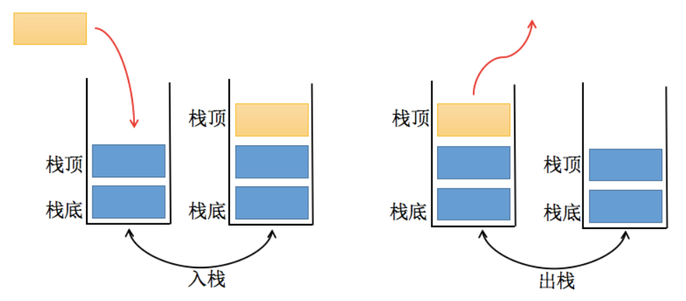

## 一、前言
### 1.1.什么是数据结构？
数据结构就是在计算机中，存储和组织数据的方式。

例如：图书管理，怎样摆放图书才能既能放很多书，也方便取？

主要需要考虑两个问题：

- 操作一：新书怎么插入？
- 操作二：怎么找到某本指定的书？
### 常见的数据结构：

- 数组（Array）
- 栈（Stack）
- 链表（Linked List）
- 图（Graph）
- 散列表（Hash）
- 队列（Queue）
- 树（Tree）
- 堆（Heap）

**注意：数据结构与算法与语言无关，常见的编程语言都有直接或间接的使用上述常见的数据结构。**

### 1.2.什么是算法？
算法（Algorithm）的定义

- 一个有限指令集，每条指令的描述不依赖于语言；
- 接收一些输入（有些情况下不需要输入）；
- 产生输入；
- 一定在有限步骤之后终止；
算法通俗理解：解决问题的办法/步骤逻辑。数据结构的实现，离不开算法。

## 二、栈结构（Stack）
### 2.1.简介
数组是一个线性结构，并且可以在数组的**任意位置**插入和删除元素。而**栈和队列**就是比较常见的**受限的线性结构**。如下图所示：

栈的特点为**先进后出，后进先出**（LIFO：last in first out）。

**程序中的栈结构：**

- **函数调用栈**：A（B（C（D（））））：即A函数中调用B，B调用C，C调用D；在A执行的过程中会将A压入栈，随后B执行时B也被压入栈，函数C和D执行时也会被压入栈。所以当前栈的顺序为：A->B->C->D（栈顶）；函数D执行完之后，会弹出栈被释放，弹出栈的顺序为D->C->B->A;

- 递归：为什么没有停止条件的递归会造成栈溢出？比如函数A为递归函数，不断地调用自己（因为函数还没有执行完，不会把函数弹出栈），不停地把相同的函数A压入栈，最后造成栈溢出（Stack Overfloat）

3.练习：题目：有6个元素6，5，4，3，2，1按顺序进栈，问下列哪一个不是合法的出栈顺序？

- A：5 4 3 6 1 2 （√）
- B：4 5 3 2 1 6 （√）
- C：3 4 6 5 2 1 （×）
- D：2 3 4 1 5 6 （√）

题目所说的按顺序进栈指的不是一次性全部进栈，而是有进有出，进栈顺序为6 -> 5 -> 4 -> 3 -> 2 -> 1。

解析：

- A答案：65进栈，5出栈，4进栈出栈，3进栈出栈，6出栈，21进栈，1出栈，2出栈（整体入栈顺序符合654321）;
- B答案：654进栈，4出栈，5出栈，3进栈出栈，2进栈出栈，1进栈出栈，6出栈（整体的入栈顺序符合654321）;
- C答案：6543进栈，3出栈，4出栈，之后应该5出栈而不是6，所以错误；
- D答案：65432进栈，2出栈，3出栈，4出栈，1进栈出栈，5出栈，6出栈。符合入栈顺序；

**栈常见的操作：**

- push（element）：添加一个新元素到栈顶位置；
- pop（）：移除栈顶的元素，同时返回被移除的元素；
- peek（）：返回栈顶的元素，不对栈做任何修改（该方法不会移除栈顶的元素，仅仅返回它）；
- isEmpty（）：如果栈里没有任何元素就返回true，否则返回false；
- size（）：返回栈里的元素个数。这个方法和数组的length属性类似；
- toString（）：将栈结构的内容以字符串的形式返回。

**常见栈的题**
- 有效的括号：https://leetcode.cn/problems/valid-parentheses/description/
- 用队列实现栈：https://leetcode.cn/problems/implement-stack-using-queues/description/

